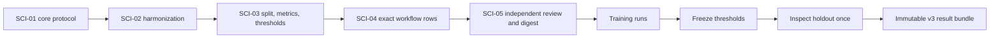

# ViralScan v3 scientific validation protocol

Status: **draft and schema-valid; outcome execution is blocked**.

The machine-readable preregistration is [`protocol.yaml`](protocol.yaml). It
fixes the supported scope, falsifiable questions, endpoint definitions, dataset
registry, known public FASTQ digests, factor names, reference roles,
outcome-independent harmonization contract, and pre-outcome exclusions for
ViralScan 3.0.

Validate the current draft:

```bash
python3 scripts/validate_v3_protocol.py
```

Training must use the stricter phase gate:

```bash
python3 scripts/validate_v3_protocol.py --phase training
```

Holdout scoring has a separate gate:

```bash
python3 scripts/validate_v3_protocol.py --phase holdout
```

Both commands intentionally fail today. Training requires the reviewed frozen
protocol; holdout additionally requires hashes for the completed training result
manifest and training-derived `thresholds.json`. A passing draft validates
structure; it does not authorize result generation.

## Freeze sequence



No holdout outcome may be inspected before the protocol digest, production
reference hashes, split manifest, threshold-search rule, tool environments, and
Git SHA are recorded in the SCI-05 freeze sidecar.

## Fixed now

- Human paired-end droplet scRNA-seq under 10x v2, 10x v3, and Drop-seq.
- Combined host-plus-virus and `host-conservative` as the product-validation
  defaults; `counts_unique` as the fair cross-tool layer.
- One checksum-pinned, outcome-independent cell anchor per dataset/library;
  reference-derived exact one-to-one target-feature intersections; and explicit
  denominator/layer mappings for every primary comparison.
- Separate synthetic cell and empty-droplet universes, fixed host-only
  EmptyDrops parameters for public data without an eligible external list, and
  no union/intersection of tool outputs for primary cell selection.
- Null metrics plus retained failure rows when comparable cells, features,
  molecule units, or required outputs are unavailable.
- Twenty-four denominator definitions mapped to all ten endpoints, including
  distinct cell precision/recall/AUPRC populations, exact-negative versus
  presumed-negative reporting, and separate execution-failure versus endpoint-
  incomparability rates.
- `X` under `host-conservative` plus exact-read QC for ViralScan evidence-tier
  validation; `counts_unique` only for primary cross-tool molecule parity.

The frozen SCI-02 subsection carries a canonical SHA-256 that is also pinned in
the schema. A second digest guards dependent hypotheses, endpoints, dataset
exclusions, and supported-scope fields against contradictory edits. Any change
to those normative fields therefore requires an explicit schema/protocol
amendment rather than an unnoticed edit.
- Five falsifiable hypotheses, two prespecified estimation objectives, and ten
  prespecified endpoints.
- Required synthetic negatives, adversarial host-homology negatives, public
  positives, observational controls, and a separate anellovirus claim gate.
- Pre-outcome exclusions only; failed, ambiguous, and unfavourable rows remain.

## Intentionally pending

- Numeric factor levels, RNG seeds, and exact train/holdout assignments.
- Production curated-reference, GRCh38 D-list, KSHV/PBMC, and environment hashes.
- Evidence-tier threshold search, limit-of-detection rule, and uncertainty plan.
- Exact STARsolo, traditional, Venus, and Viral-Track workflow rows.

Each pending field names the `PLAN.md` task that resolves it. Guessed hashes,
thresholds, seeds, or comparator versions are prohibited.

## Amendment rule

After SCI-05, any unplanned change to code, references, the threshold-selection
rule, partitions, barcodes, features, metrics, or workflow parameters is a
protocol amendment. Producing the prespecified learned threshold from training
data, recording its value/hash, and opening the holdout gate is the planned phase
transition—not an amendment. Changing that rule or value after holdout unblinding
is an amendment. Preserve original runs/results, record timing and reason, create
a new digest, and rerun every affected row. Never replace an unfavourable or
failed row silently.
